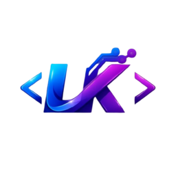

# 🎌 AnimeSekai — Ecommerce de Tesoros Otaku

<div align="center">



[](https://reactjs.org/)
[](https://vitejs.dev/)
[](https://mui.com/)

</div>

---

## 📝 Descripción

**AnimeSekai** es una plataforma de comercio electrónico moderna y dinámica diseñada específicamente para la comunidad amante del anime, manga y coleccionables japoneses. El proyecto combina una estética visual audaz con una funcionalidad fluida para ofrecer la mejor experiencia de usuario.

Este proyecto es una **Aplicación de Página Única (SPA)** desarrollada con **React + Vite**. Su objetivo principal es permitir a los usuarios:

- 🔎 Navegar por un catálogo de productos interactivo.
- 🛒 Gestionar un carrito de compras en tiempo real.
- ❤️ Mantener una lista de deseos (favoritos) personalizada.

La aplicación destaca por su alto rendimiento y una gestión de estado global eficiente mediante **Context API**, sin dependencias externas de estado como Redux.

---

## ✨ Características Principales

| Característica | Descripción |
|---|---|
| 🛒 **Carrito Dinámico** | Añade y elimina productos con actualización automática en el Header mediante `useContext`. |
| ❤️ **Sistema de Favoritos** | Gestión de una Wishlist personalizada para guardar artículos de interés. |
| 💾 **Persistencia de Datos** | Integración con `LocalStorage` para mantener los productos del usuario incluso tras refrescar el navegador. |
| 📱 **Diseño 100% Responsivo** | Interfaz optimizada para móviles, tablets y escritorio utilizando Material UI. |

---

## 🎨 Interfaz Gráfica

La interfaz de **AnimeSekai** sigue una línea visual inspirada en el diseño contemporáneo japonés:

### Paleta de Colores

```
Fondo principal:   #FFFFFF  (Blanco)
Fondo secundario:  #F5F5F5  (Gris Claro)
Color de acento:   #D32F2F  (Rojo Carmesí) ← Botones y elementos críticos
Texto principal:   #212121  (Casi Negro)
Texto secundario:  #757575  (Gris Medio)
```

### Tipografía

- **Primaria:** [Poppins](https://fonts.google.com/specimen/Poppins) — Encabezados y títulos.
- **Secundaria:** [Roboto](https://fonts.google.com/specimen/Roboto) — Cuerpo de texto y descripciones.

### Componentes Visuales

- 🃏 **Cards con elevación** y transiciones suaves en `hover`.
- 🔢 **Badges** notificados en el ícono del carrito.
- 📲 **Drawer lateral** para el carrito de compras.
- 🧭 **Navbar** fija con búsqueda integrada.


## 🏗️ Arquitectura del Proyecto

El proyecto sigue un **patrón de diseño modular** para facilitar la escalabilidad y el mantenimiento técnico:

```
t3_shop/
├── public/
│   └── img/                        # Imágenes estáticas (avif, svg, webp)
│       ├── estampados.avif
│       ├── figuras-scale.avif
│       ├── fondo.avif
│       ├── manga.avif
│       ├── notorious-funko.avif
│       └── Logo1.0.webp
│
├── src/
│   ├── features/
│   │   ├── auth/                   # Módulo de autenticación y carrito
│   │   │   ├── components/
│   │   │   │   ├── Myaccount.jsx
│   │   │   │   ├── Mybuys.jsx
│   │   │   │   └── Myfavourites.jsx
│   │   │   └── Hooks/
│   │   │       └── CartContext.jsx  # Contexto global del carrito
│   │   │
│   │   ├── layout/                 # Estructura visual principal
│   │   │   ├── components/
│   │   │   │   ├── Content.jsx
│   │   │   │   ├── Footer.jsx
│   │   │   │   ├── Header.jsx
│   │   │   │   └── Home.css
│   │   │   └── hooks/
│   │   │       ├── useCart.jsx
│   │   │       └── useFavorites.jsx
│   │   │
│   │   └── view/                   # Vistas de contenido dinámico
│   │       ├── components/
│   │       │   ├── Article.jsx
│   │       │   └── Offers.jsx
│   │       └── Hooks/
│   │           ├── useCallback.jsx
│   │           ├── useContext.jsx
│   │           ├── useCustom.jsx
│   │           ├── useEffects.jsx
│   │           ├── useOnlineStatus.jsx
│   │           ├── useReducer.jsx
│   │           ├── useRef.jsx
│   │           └── useState.jsx
│   │
│   ├── shared/                     # Recursos y componentes compartidos
│   ├── App.jsx                     # Componente raíz
│   ├── main.jsx                    # Punto de entrada
│   └── routes.jsx                  # Configuración de rutas
│
├── .gitignore
├── eslint.config.js
├── index.html
├── package.json
├── README.md
└── vite.config.js
```

---

## 🛠️ Stack Tecnológico

| Capa | Tecnología | Versión |
|---|---|---|
| **Framework** | React.js | 18.x |
| **Build Tool** | Vite | 5.x |
| **UI Library** | Material UI (MUI) | 5.x |
| **Estilos** | CSS3 + MUI System | — |
| **Estado Global** | React Context API | Built-in |
| **Hooks Personalizados** | useCart, useFavorites, useCustom | — |
| **Enrutamiento** | React Router DOM | 6.x |
| **Iconografía** | MUI Icons + Font Awesome | — |
| **Persistencia** | LocalStorage API | Built-in |

---

## 🚀 Instalación y Uso

Sigue estos pasos para ejecutar el proyecto localmente:

```bash
# 1. Clonar el repositorio
git clone https://github.com/TuUsuario/animesekai.git

# 2. Navegar al directorio del proyecto
cd animesekai

# 3. Instalar las dependencias
npm install

# 4. Iniciar el servidor de desarrollo
npm run dev
```

La aplicación estará disponible en `http://localhost:5173`. O en el Link que le de su ejecutor de codigo cuando inicialice el proyecto

---

## 📁 Scripts Disponibles

| Comando | Descripción |
|---|---|
| `npm run dev` | Inicia el servidor de desarrollo con HMR |

---

## 👨‍💻 Datos del Autor

<div align="center">

| | |
|:---:|:---|
| 👤 **Nombre** | Luz Karime Loaiza Muñoz |
| 🏛️ **Institución** | SENA |
| 🎓 **Programa** | Tecnología en Análisis y Desarrollo de Software |
| 💼 **Rol** | Desarrollador Frontend / UI Designer |
| 📧 **Correo** | Lkarimex27@gmail.com |
| 🐙 **GitHub** | [@lkarimex27-dotcom](https://github.com/lkarimex27-dotcom/t3-shopAnime) |

</div>


<div align="center">

Hecho con ❤️ y mucha pasión por el anime 🎌

**AnimeSekai © 2026**

</div>
